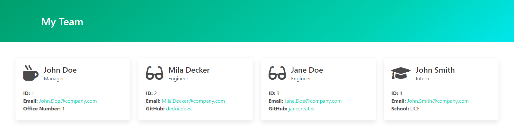

# Team Profile Generator 

## Description
A Node.js application to create a simple webpage featuring your development team's roster.

## Contents
* [Installation](#Installation)
* [Usage](#Usage)
   * [Video Demo](#Video-Demo)
   * [Screenshots](#Screenshots)
* [Tests](#Tests)
* [Questions](#Questions)
* [Credits](#Credits)


## Installation
To use this application, please install: 
```
npm install inquirer
```
    
## Usage
After cloning the repo and installing the required npm packages, use the command line to navigate to the root of the application and run `node index`.  Follow prompts to add team members to your roster.  Only one manager can be added per team.  Your generated team roster page will be created in the `./dist` folder. 

### Screenshots

An example of the generated team roster page.


## Tests
To run tests on the application, install
```
npm install jest
```

and run `npm run test` from the command line.
    
    

